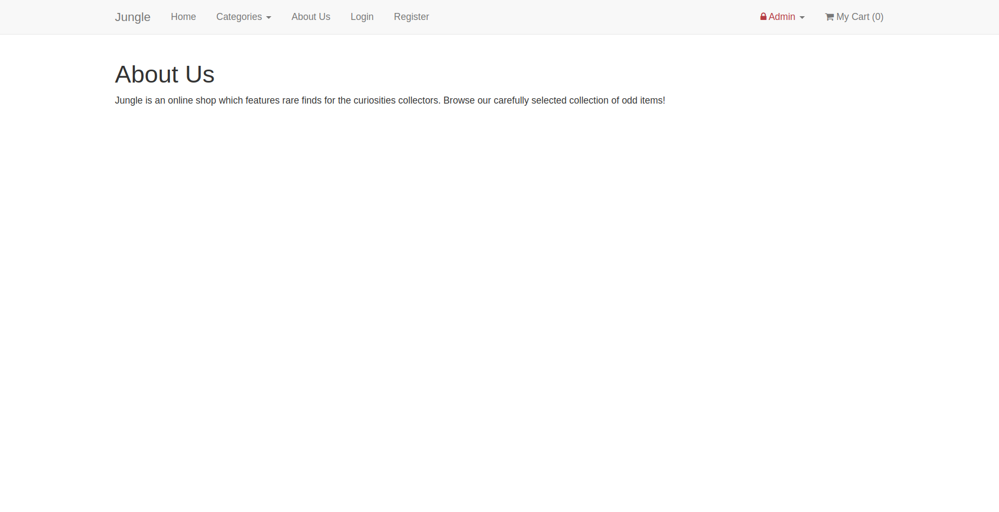

# Jungle

A mini e-commerce application built with Rails 4.2 for purposes of teaching Rails by example. 

It uses RESTful routes, follows the MVC model, uses HTTP basic authentication for the admin login, password encryption for the users, postgresql and Active Record for database queries, and Capybara and Rspec for testing.

This app was built by Felix Rioux Sabourin in the week 10 of the [Lighthouse Labs](https://www.lighthouselabs.ca/web-bootcamp) web develpment bootcamp.

## Setup

1. Run `bundle install` to install dependencies
2. Create `config/database.yml` by copying `config/database.example.yml`
3. Create `config/secrets.yml` by copying `config/secrets.example.yml`
4. Run `bin/rake db:reset` to create, load and seed db
5. Create .env file based on .env.example
6. Sign up for a Stripe account
7. Put Stripe (test) keys into appropriate .env vars
8. Run `bin/rails s -b 0.0.0.0` to start the server

## Stripe Testing

Use Credit Card # 4111 1111 1111 1111 for testing success scenarios.

More information in their docs: <https://stripe.com/docs/testing#cards>

## Dependencies

* Rails 4.2 [Rails Guide](http://guides.rubyonrails.org/v4.2/)
* PostgreSQL 9.x
* Stripe
* bcrypt 3.1.7

## Test Dependencies

* rspec-rails 3.5
* capybara
* poltergeist
* database_cleaner

## Final Product

